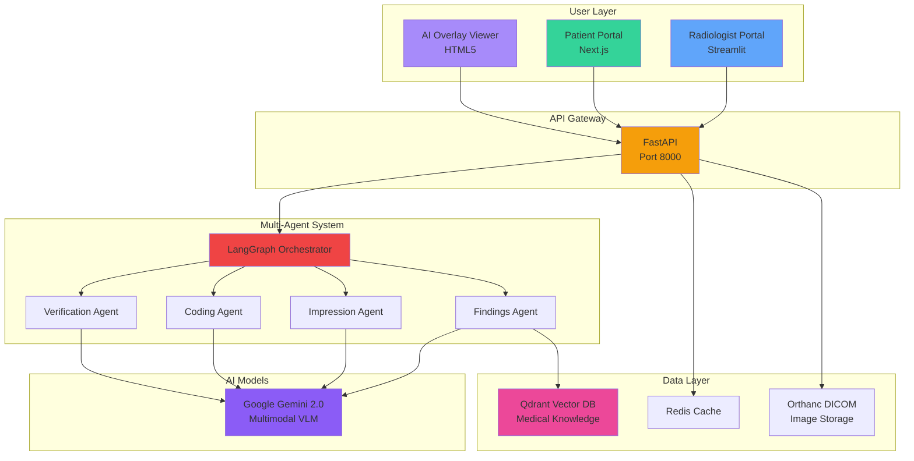
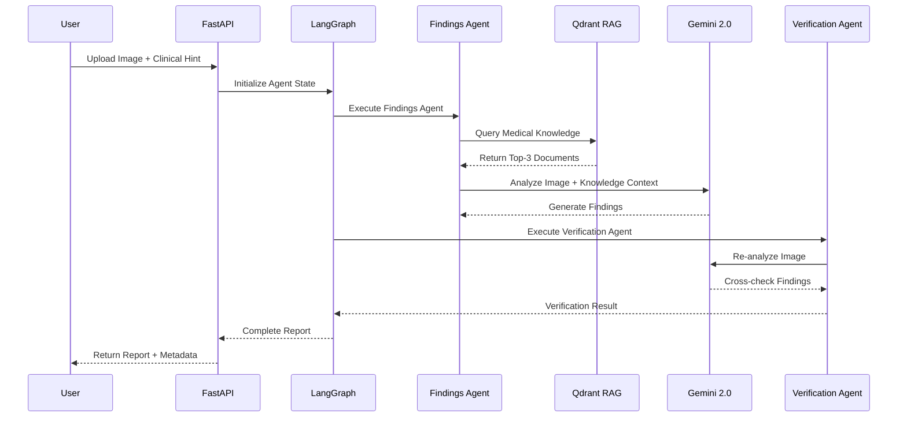
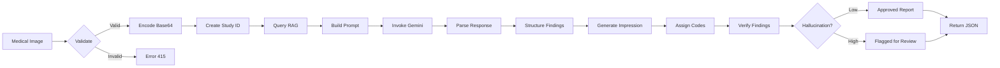
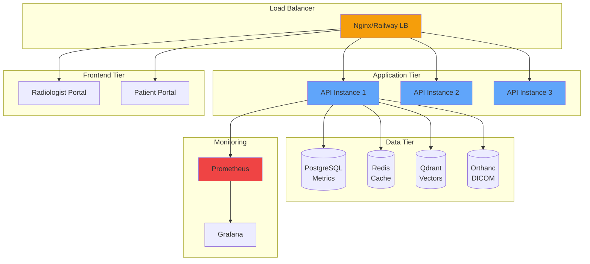

# LuminaMed AI - Architecture Diagrams

---

## System Architecture

```mermaid
graph TB
    subgraph "User Layer"
        A[Radiologist Portal<br/>Streamlit]
        B[Patient Portal<br/>Next.js]
        C[AI Overlay Viewer<br/>HTML5]
    end
    
    subgraph "API Gateway"
        D[FastAPI<br/>Port 8000]
    end
    
    subgraph "Multi-Agent System"
        E[LangGraph Orchestrator]
        F[Findings Agent]
        G[Impression Agent]
        H[Coding Agent]
        I[Verification Agent]
    end
    
    subgraph "Data Layer"
        J[Qdrant Vector DB<br/>Medical Knowledge]
        K[Redis Cache]
        L[Orthanc DICOM<br/>Image Storage]
    end
    
    subgraph "AI Models"
        M[Google Gemini 2.0<br/>Multimodal VLM]
    end
    
    A --> D
    B --> D
    C --> D
    D --> E
    E --> F
    E --> G
    E --> H
    E --> I
    F --> J
    F --> M
    G --> M
    H --> M
    I --> M
    D --> K
    D --> L
    
    style A fill:#60a5fa
    style B fill:#34d399
    style C fill:#a78bfa
    style D fill:#f59e0b
    style E fill:#ef4444
    style J fill:#ec4899
    style M fill:#8b5cf6
```

---

## Agent Workflow

```mermaid
sequenceDiagram
    participant U as User
    participant API as FastAPI
    participant LG as LangGraph
    participant FA as Findings Agent
    participant RAG as Qdrant RAG
    participant AI as Gemini 2.0
    participant VA as Verification Agent
    
    U->>API: Upload Image + Clinical Hint
    API->>LG: Initialize Agent State
    LG->>FA: Execute Findings Agent
    FA->>RAG: Query Medical Knowledge
    RAG-->>FA: Return Top-3 Documents
    FA->>AI: Analyze Image + Knowledge Context
    AI-->>FA: Generate Findings
    LG->>VA: Execute Verification Agent
    VA->>AI: Re-analyze Image
    AI-->>VA: Cross-check Findings
    VA-->>LG: Verification Result
    LG-->>API: Complete Report
    API-->>U: Return Report + Metadata
```

---

## Data Flow - Report Generation

```mermaid
flowchart LR
    A[Medical Image] --> B{Validate}
    B -->|Valid| C[Encode Base64]
    B -->|Invalid| D[Error 415]
    C --> E[Create Study ID]
    E --> F[Query RAG]
    F --> G[Build Prompt]
    G --> H[Invoke Gemini]
    H --> I[Parse Response]
    I --> J[Structure Findings]
    J --> K[Generate Impression]
    K --> L[Assign Codes]
    L --> M[Verify Findings]
    M --> N{Hallucination?}
    N -->|Low| O[Approved Report]
    N -->|High| P[Flagged for Review]
    O --> Q[Return JSON]
    P --> Q
```

---

## Deployment Architecture (Production)

```mermaid
graph TB
    subgraph "Load Balancer"
        LB[Nginx/Railway LB]
    end
    
    subgraph "Application Tier"
        API1[API Instance 1]
        API2[API Instance 2]
        API3[API Instance 3]
    end
    
    subgraph "Frontend Tier"
        RAD[Radiologist Portal]
        PAT[Patient Portal]
    end
    
    subgraph "Data Tier"
        PG[(PostgreSQL<br/>Metrics)]
        RD[(Redis<br/>Cache)]
        QD[(Qdrant<br/>Vectors)]
        OR[(Orthanc<br/>DICOM)]
    end
    
    subgraph "Monitoring"
        PROM[Prometheus]
        GRAF[Grafana]
    end
    
    LB --> API1
    LB --> API2
    LB --> API3
    LB --> RAD
    LB --> PAT
    
    API1 --> PG
    API1 --> RD
    API1 --> QD
    API1 --> OR
    
    API1 --> PROM
    PROM --> GRAF
    
    style LB fill:#f59e0b
    style API1 fill:#60a5fa
    style API2 fill:#60a5fa
    style API3 fill:#60a5fa
    style PROM fill:#ef4444
```